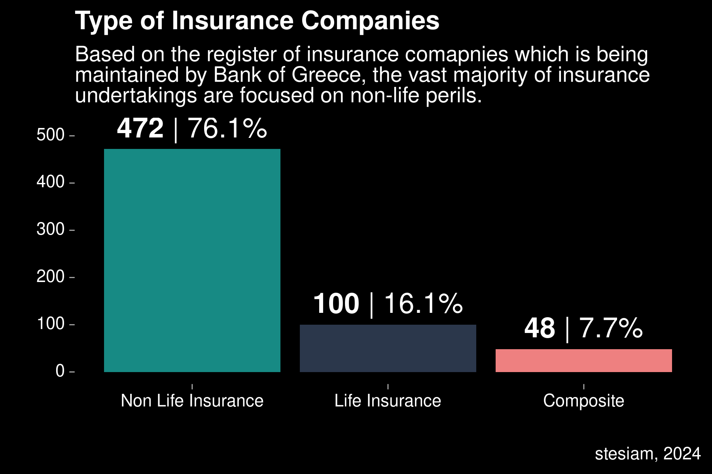

# 📋 Register of Insurance Undertakings

A script to scrape BoF's page in order to select information about every insurance undertaking. 
Due to the fact that the site has dynamic tables it was necessary to use RSelenium along with rvest.

Except from the scrtpt I ctreated some basic viz based on the extracted data.

💾 Source: [Bank of Greece](https://www.bankofgreece.gr/en/main-tasks/supervision/private-insurance/insurance-undertakings/register)

